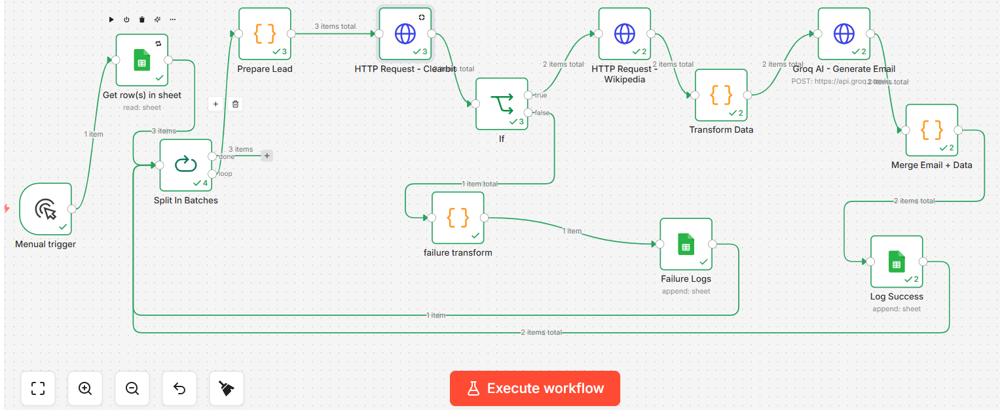

# 🤖 AI Lead Enrichment & Cold Email Automation (n8n)

> An end-to-end automation workflow that takes a company name and returns an enriched lead profile + a personalized cold email — all on the free tier.




---

## 📌 Overview

This project was built as part of an AI & Automation internship assignment. The goal was to design a fully functional n8n workflow that:

1. Accepts a list of company names as input (via Google Sheets)
2. Automatically enriches each lead using free public APIs
3. Generates a personalized cold outreach email using an LLM
4. Logs every result — success or failure — back to Google Sheets

No paid APIs. No manual data entry. Just a company name in — and a ready-to-send cold email out.

---

## ✨ Features

- **Automated Lead Enrichment** — fetches domain, website, niche, and location from just a company name
- **AI-Powered Email Generation** — uses Groq's LLaMA 3 model to write personalized, human-sounding cold emails
- **Smart Fallbacks** — if Clearbit or Wikipedia can't find a company, the workflow degrades gracefully instead of crashing
- **Failure Handling** — an IF node separates enriched leads from failed ones, both paths are logged separately
- **Google Sheets Integration** — reads input and writes all output back to a structured log sheet
- **100% Free Tier** — no paid plans, no credit cards required for any service used

---

## 🏗️ Workflow Architecture

The workflow follows a linear enrichment pipeline with a conditional branch:

```
Google Sheets (Input)
        ↓
Split In Batches (1 lead at a time)
        ↓
Prepare Lead (normalize + format company name)
        ↓
        ├──→ HTTP Request: Clearbit (fetch domain)
        └──→ HTTP Request: Wikipedia (fetch summary)
                        ↓
              Transform Data (extract niche, location, website, email)
                        ↓
               IF Node: enrichment success?
              ↙                          ↘
   Groq AI (generate email)      Google Sheets (log failure)
        ↓
   Extract + Merge (parse subject + body)
        ↓
   Google Sheets (log success)
```

### Node Breakdown

| # | Node | Type | Purpose |
|---|------|------|---------|
| 1 | Google Sheets | Trigger | Reads company names from input sheet |
| 2 | Split In Batches | Core | Processes one lead at a time |
| 3 | Prepare Lead | Code (JS) | Normalizes company name, builds Wikipedia-safe query |
| 4 | HTTP Request - Clearbit | HTTP | Fetches company domain via Clearbit Autocomplete API |
| 5 | HTTP Request - Wikipedia | HTTP | Fetches company summary for niche + location extraction |
| 6 | Transform Data | Code (JS) | Extracts website, email, niche, location from API responses |
| 7 | IF Node | Logic | Branches on enrichment success vs failure |
| 8 | Groq AI - Generate Email | HTTP | Calls Groq LLaMA3 to generate personalized cold email |
| 9 | Extract + Merge | Code (JS) | Parses subject line and body from AI response |
| 10 | Google Sheets - Log Success | Output | Appends enriched lead + email to Sheets |
| 11 | Google Sheets - Log Failure | Output | Logs failed leads with status "FAILED" |

---

## 🗺️ Workflow Diagram


---

## 🛠️ Tech Stack

| Tool | Purpose | Cost |
|------|---------|------|
| [n8n](https://n8n.io) | Workflow automation engine | Free (cloud or self-host) |
| [Clearbit Autocomplete API](https://clearbit.com/docs#autocomplete-api) | Company domain lookup | Free, no API key |
| [Wikipedia REST API](https://en.wikipedia.org/api/rest_v1/) | Company summary scraping | Free, requires User-Agent header |
| [Groq API](https://console.groq.com) | LLM email generation (LLaMA 3) | Free, 14,400 req/day |
| [Google Sheets](https://sheets.google.com) | Input source + output logging | Free, Google account |

---

## ⚙️ Setup Instructions

### Prerequisites

- n8n account at [cloud.n8n.io](https://cloud.n8n.io) (free tier) or self-hosted via `npx n8n`
- Google account (for Sheets)
- Groq API key from [console.groq.com](https://console.groq.com) (free, no card)

### Step 1 — Clone this repo

```bash
git clone https://github.com/YOUR_USERNAME/ai-lead-enrichment-n8n.git
cd ai-lead-enrichment-n8n
```

### Step 2 — Import the workflow

1. Open n8n
2. Go to **Workflows → Import**
3. Upload `workflow/lead-enrichment-workflow.json`

### Step 3 — Configure credentials

#### Google Sheets
1. In n8n → **Settings → Credentials → New → Google Sheets OAuth2**
2. Follow the Google login flow
3. Create a sheet named `Leads Log` with these columns:

| company | website | email | niche | location | emailSubject | emailBody | status | timestamp |
|---------|---------|-------|-------|----------|-------------|-----------|--------|-----------|

#### Groq API
1. Sign up at [console.groq.com](https://console.groq.com)
2. Create an API key
3. In the **Groq AI HTTP Request node** → Headers → set:
   ```
   Authorization: Bearer YOUR_GROQ_KEY_HERE
   ```

#### Wikipedia (no key needed)
The Wikipedia HTTP Request node already includes the required `User-Agent` header:
```
User-Agent: n8n-lead-enrichment/1.0 (your@email.com)
```
Update the email address to your own.

### Step 4 — Add your leads

In your Google Sheet, fill column A (`company`) with company names:

```
Pathao
ShopUp
BRAC Bank
Shajgoj
```

### Step 5 — Run the workflow

Click **Execute Workflow** in n8n. Results appear in Google Sheets within seconds.

---

## 📊 Sample Output

### Enriched Lead (Google Sheets row)

| company | website | email | niche | location | status |
|---------|---------|-------|-------|----------|--------|
| Pathao | https://pathao.com | info@pathao.com | Ride-Sharing Tech | Dhaka, Bangladesh | SUCCESS |
| ShopUp | https://shopup.com | info@shopup.com | SaaS | Dhaka, Bangladesh | SUCCESS |
| BRAC Bank | https://bracbank.com | info@bracbank.com | Banking & Finance | Dhaka, Bangladesh | SUCCESS |

### AI-Generated Cold Email (Pathao example)

```
Subject: Scaling Last-Mile Delivery in Dhaka — A Quick Idea

Pathao has built something genuinely impressive — a super app handling
ride-sharing, food delivery, and courier logistics all under one roof in
one of South Asia's most competitive markets.

We help logistics and on-demand platforms across the region automate their
B2B outreach pipeline so the sales team spends less time prospecting and
more time closing. Companies in the Ride-Sharing Tech space typically see
a 3x improvement in response rates within the first 60 days.

Would it make sense to connect for 15 minutes this week to see if this is
relevant for where Pathao is headed?

The OutreachBot Team
```

---

## 📁 Project Structure

```
ai-lead-enrichment-n8n/
├── workflow/
│   └── lead-enrichment-workflow.json   # n8n workflow export
├── docs/
│   └── screenshots/
│       └── workflow.png                # n8n canvas screenshot
├── sample-output/
│   ├── enriched-leads.csv              # Sample Google Sheets export
│   └── sample-email.txt               # Example AI-generated email
└── README.md
```

---

## ⚠️ Limitations

| Limitation | Detail |
|-----------|--------|
| **Clearbit results are approximate** | The free Autocomplete API returns the closest match — may occasionally pick the wrong company for ambiguous names |
| **Wikipedia coverage** | Not every company has a Wikipedia page. If a 404 is returned, the workflow falls back to `"Tech Company"` for niche and `"Bangladesh"` for location |
| **Email is guessed, not verified** | Contact emails are generated as `info@domain` — they are not scraped or verified real addresses |
| **Niche is keyword-based** | Niche detection uses keyword matching on Wikipedia text — works well for known companies, less reliable for niche B2B firms |
| **No LinkedIn scraping** | LinkedIn data is not used (ToS restrictions) — all enrichment is from public, freely accessible APIs |
| **25 Hunter.io searches/month** | If real verified emails are needed, Hunter.io free tier can be added but is limited to 25 searches/month |

---

## 🎥 Demo Video

> 📹 A full screen recording walkthrough of the workflow — from trigger to Google Sheets output — is available here:

**[Watch Demo Video →](https://your-video-link-here.com)**

The walkthrough covers:
- Each node's role and configuration
- A live run with 3 Dhaka-based companies
- The IF node branching in action
- Final Google Sheets output with AI-generated emails

---

## 👨‍💻 Author

**Md Sakib Ahmed**
AI & Automation Intern Assignment — moiAKU iBOS

- 📧 mdsakibahmed848@gmail.com
- 🔗 [LinkedIn](https://linkedin.com/in/YOUR_HANDLE)
- 🐙 [GitHub](https://github.com/YOUR_USERNAME)

---

## 📄 License

This project is open source and available under the [MIT License](LICENSE).

---

<p align="center">Built with ❤️ using n8n, Groq, Clearbit, and Wikipedia — all on the free tier.</p>
